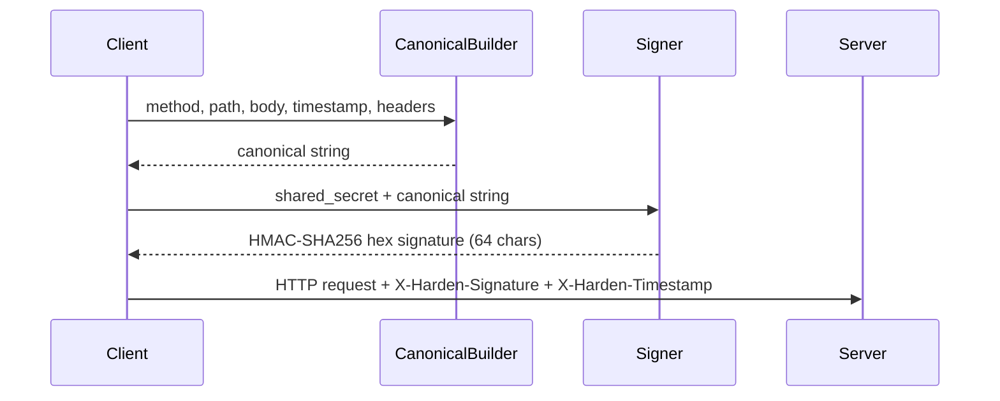
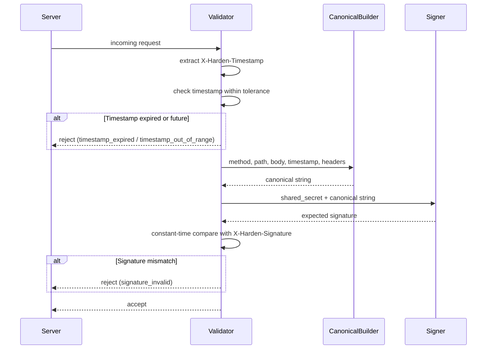
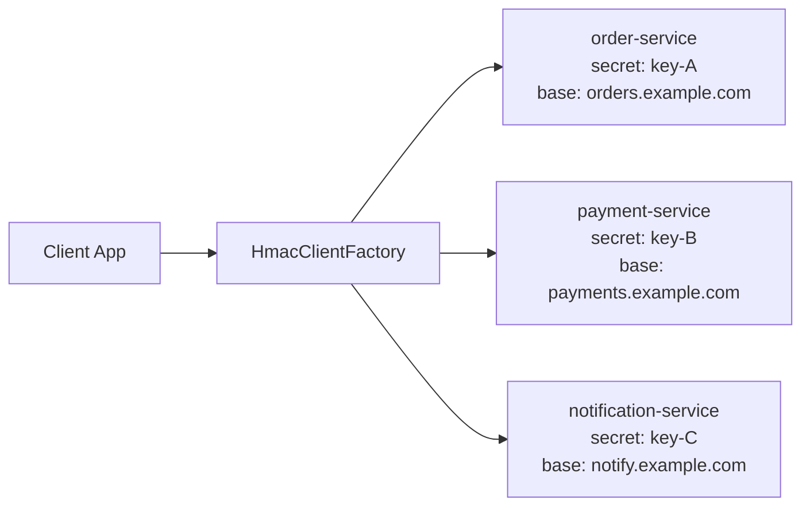
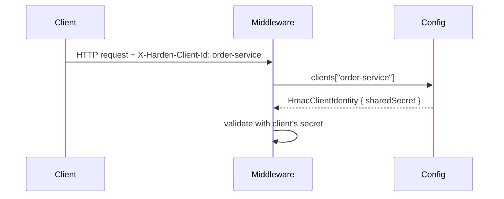
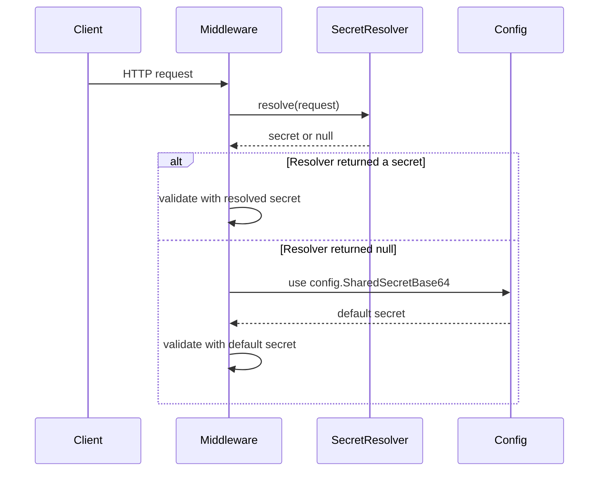

# HardenHMAC Architecture

## Overview

HardenHMAC is a cross-language HMAC-SHA256 request signing library. It provides identical implementations in C#, Python, and TypeScript that produce the same signature for the same inputs, guaranteed by a shared test vector suite.

The library has no server component, no state, and no key management. It is a pure computation library: given a shared secret and request components, it produces a deterministic HMAC-SHA256 signature.

## Core Design Decisions

1. **Defined canonical string format** eliminates cross-language signature mismatch debugging
2. **No server dependency** makes adoption trivial (install package, configure secret)
3. **Shared test vectors** are authoritative; implementations must conform to the vectors
4. **Constant-time signature comparison** prevents timing attacks
5. **No replay protection** keeps the library stateless; implementers add nonces if needed

## Signing Flow



### Steps

1. Client extracts request components: method, path (with query string), body, current Unix timestamp
2. Signed headers are selected based on configuration (Authorization, X-* headers, additional/excluded)
3. Canonical string is built: `METHOD\nPATH\nSIGNED_HEADERS\nBODY\nTIMESTAMP`
4. HMAC-SHA256 is computed over the canonical string using the shared secret (base64-decoded)
5. Signature (lowercase hex, 64 chars) is attached as `X-Harden-Signature` header
6. Timestamp is attached as `X-Harden-Timestamp` header
7. If headers were signed, their names are listed in `X-Harden-Signed-Headers` (semicolon-separated)

## Validation Flow



### Steps

1. Extract `X-Harden-Timestamp` from request headers; reject if missing
2. Parse timestamp as integer; reject if not a valid integer
3. Check timestamp is within tolerance window (default 30 seconds); reject with appropriate error type
4. Extract `X-Harden-Signature` from request headers; reject if missing
5. Rebuild the canonical string from the request (using the received timestamp)
6. Compute the expected HMAC-SHA256 signature
7. Compare expected vs received signature using constant-time comparison
8. Accept or reject

## Canonical String Format

Version 1.0. See `CANONICAL-STRING-SPEC.md` for the formal specification.

```
METHOD\nPATH\nSIGNED_HEADERS\nBODY\nTIMESTAMP
```

The canonical string is always exactly 5 fields separated by `\n` (newline). Fields may be empty but the delimiters are always present.

### Field Definitions

| Field | Content | Empty value |
|-------|---------|-------------|
| METHOD | HTTP method, uppercase | Never empty |
| PATH | Request path including query string, as-is | Never empty (minimum `/`) |
| SIGNED_HEADERS | Sorted `name:value` pairs joined by `\n` | Empty string |
| BODY | Request body as string | Empty string |
| TIMESTAMP | Unix timestamp in seconds as string | Never empty |

## HTTP Header Transmission

| Header | Purpose | Always present |
|--------|---------|----------------|
| `X-Harden-Signature` | 64-char lowercase hex HMAC signature | Yes |
| `X-Harden-Timestamp` | Unix timestamp in seconds | Yes |
| `X-Harden-Signed-Headers` | Semicolon-separated sorted header names | Only if headers are signed |

## Signed Headers Configuration

The library supports flexible configuration for which request headers are included in the signature:

- **IncludeAuthorization** (default: `true`): Include the `Authorization` header
- **IncludeXHeaders** (default: `true`): Include all `X-*` headers except `X-Harden-*`
- **AdditionalHeaders**: Explicit list of additional headers to include
- **ExcludeHeaders**: Override list of headers to exclude (takes precedence)

### Header Processing Rules

1. Collect headers based on configuration flags
2. Apply exclude list (case-insensitive match)
3. Always exclude `X-Harden-*` headers (they carry the signature itself)
4. Sort remaining headers alphabetically by lowercase name
5. Format each as `lowercasename:trimmedvalue`
6. Join with `\n`

## Configuration Loading

HardenHMAC supports three configuration sources across all languages:

### Programmatic Configuration
Direct code construction (as shown in Quick Start examples). This is the simplest approach.

### Environment Variables
All SDKs support the `HARDEN_HMAC_` prefix convention. The `__` separator maps to nested configuration:

```
HARDEN_HMAC_SHARED_SECRET_BASE64=base64-key
HARDEN_HMAC_TIMESTAMP_TOLERANCE_SECONDS=30
HARDEN_HMAC_TARGETS__ORDER_SERVICE__BASE_URL=https://orders.example.com
HARDEN_HMAC_TARGETS__ORDER_SERVICE__SHARED_SECRET=base64-key
```

- **C#**: `IConfiguration` handles `__` natively. Use `AddHardenHmac(configuration.GetSection("HardenHmac"))`.
- **Python**: `HmacConfig.from_env()`. Optionally loads `.env` via python-dotenv.
- **TypeScript**: `fromEnv()`. Optionally loads `.env` via dotenv (peer dependency).

### Config File (C# only)
`appsettings.json` binding via `IConfiguration`:
```json
{
  "HardenHmac": {
    "SharedSecretBase64": "base64-key",
    "Targets": {
      "order-service": { "BaseUrl": "...", "SharedSecret": "..." }
    }
  }
}
```

## Multi-Target Design

The multi-target pattern allows a single client process to sign requests for multiple backend services, each with a different shared secret and optional configuration overrides.



### Configuration Hierarchy
Per-target settings override global defaults:

| Setting | Global | Per-Target | Resolution |
|---------|--------|------------|------------|
| SharedSecret | `config.SharedSecretBase64` | `target.SharedSecret` | Target if set, else global |
| SignedHeaders | `config.SignedHeaders` | `target.SignedHeaders` | Target if set, else global |
| TimestampTolerance | `config.TimestampToleranceSeconds` | `target.TimestampToleranceSeconds` | Target if set, else global |

### Client Factory Pattern
Each language provides a factory that creates pre-configured HTTP clients:
- **C#**: `IHardenHmacClientFactory.CreateClient(targetName)` returns `HttpClient` with `BaseAddress` and signing handler
- **Python**: `HmacClientFactory.create_client(targetName)` returns `httpx.AsyncClient` (or `create_sync_client` for sync)
- **TypeScript**: `createHmacClientFactory(config).createClient(targetName)` returns a signed fetch wrapper

## Multi-Client Server Configuration

For servers that accept requests from a known set of clients, each with their own shared secret, use the `Clients` dictionary on `HmacConfig`. Clients identify themselves by sending an `X-Harden-Client-Id` header.



### Resolution Order

The middleware resolves the shared secret in this order:

1. **secretResolver callback** (if provided and returns non-null) -- highest priority
2. **X-Harden-Client-Id header** present and found in `config.Clients` -- use that client's secret
3. **X-Harden-Client-Id header** present but NOT found in `config.Clients` -- reject with `unknown_client` (401)
4. **No X-Harden-Client-Id header** -- fall back to `config.SharedSecretBase64`
5. **No secret resolved** -- reject with `no_secret` (401)

### X-Harden-Client-Id Is Signed

Unlike other `X-Harden-*` headers (Signature, Timestamp, Signed-Headers), the `X-Harden-Client-Id` header IS included in the HMAC signature. It is an identity claim, not signing metadata, so it must be protected against tampering.

### Client-Side Auto-Send

When using the client factory (`CreateClient`/`createClient`/`create_client`), the target name is automatically sent as `X-Harden-Client-Id`. The server uses this to look up the correct shared secret.

| Header | Purpose | Signed? |
|--------|---------|---------|
| `X-Harden-Signature` | HMAC signature | No (excluded) |
| `X-Harden-Timestamp` | Unix timestamp | No (excluded) |
| `X-Harden-Signed-Headers` | Header names | No (excluded) |
| `X-Harden-Client-Id` | Client identity | **Yes (included)** |

## Secret Resolver (Server-Side Multi-Tenant)

For servers that validate requests from multiple clients with different secrets, middleware accepts an optional `secretResolver` callback:



If both the resolver and config have no secret, the middleware returns 401 with `no_secret` error.

## Timestamp Validation

- Default tolerance: 30 seconds
- Configurable per server instance
- Past timestamps beyond tolerance produce `timestamp_expired` error
- Future timestamps beyond tolerance produce `timestamp_out_of_range` error
- Tolerance is applied symmetrically: `|now - timestamp| <= tolerance`

## Security Properties

### What This Library Provides

- **Request integrity**: Modifications to method, path, body, or signed headers invalidate the signature
- **Request authentication**: Only parties with the shared secret can produce valid signatures
- **Timing attack resistance**: All signature comparisons use constant-time algorithms
- **Freshness checking**: Configurable timestamp tolerance window

### What This Library Does NOT Provide

- **Replay protection**: A valid request can be replayed within the timestamp window. Implementers should add nonce tracking if needed.
- **Key management**: Key generation, distribution, storage, and rotation are the implementer's responsibility.
- **Key rotation**: No built-in mechanism. Coordinate key changes across services manually.
- **Body confidentiality**: The request body is signed but not encrypted.

### Migration Path to HardenAPI

For teams that outgrow static shared secrets, [HardenAPI](https://hardenapi.com) provides:

- Automatic ephemeral key rotation (30-second to 1-hour TTL)
- KMS-backed key generation (no shared secret management)
- Service pair model with blast radius isolation
- TOTP + HMAC layered authentication
- Optional RSA non-repudiation signing
- Zero key coordination between teams

HardenHMAC's canonical string format is a subset of HardenAPI's signing format, making migration straightforward: replace the static secret with HardenAPI SDK configuration.
